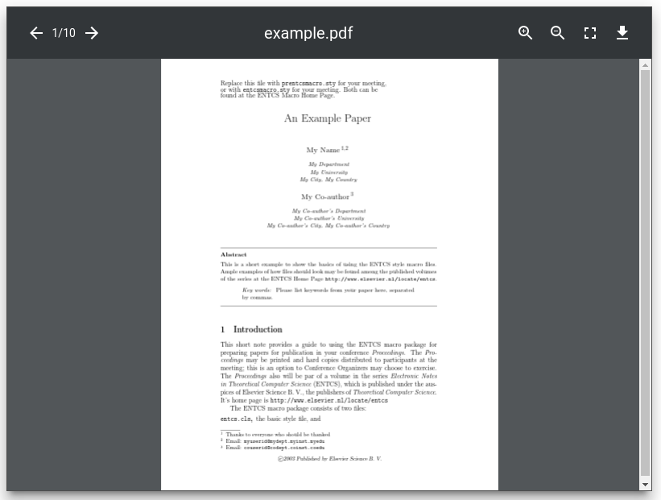

Web component built with Polymer which allows to view PDF files.
This component based on similar [component](https://github.com/roman01la/pdf-reader-web-component) by [Roman Liutikov](https://github.com/roman01la).

### Features

- Next/Previous page
- Zoom
- Download
- Compatible with Polymer 1.0.
- Looks nice :)

{:.responsive-img}
{:.center-align}

### Installation


git clone https://github.com/streetturtle/pdf-element.git
cd ./pdf-element
gulp serve


### Licence

**The MIT License (MIT)**

© 2016 Pavel Makhov